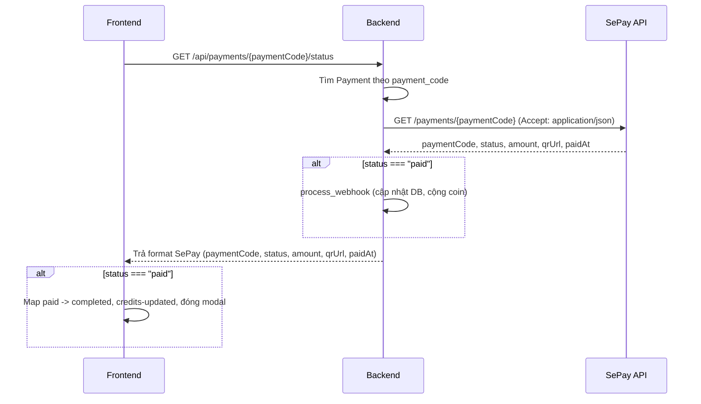

# Kế hoạch: API forward trạng thái SePay và trả format tương tự cho FE

## Hiện trạng

- Backend đã có [backend/api/routes/payments.py](backend/api/routes/payments.py): `GET /payments/{identifier}/status` — tìm Payment theo `payment_code` hoặc `transaction_id`, nếu có `payment_code` thì gọi SePay `GET {SEPAY_API_URL}/payments/{payment_code}`, khi SePay trả `status === "paid"` thì gọi `PaymentService.process_webhook(...)` (cập nhật DB + cộng coin), sau đó trả về `PaymentService.get_payment_status()` (format nội bộ: `transaction_id`, `status: "completed"`, `amount`, `credits`, ...).
- FE [frontend/components/QRPaymentModal.tsx](frontend/components/QRPaymentModal.tsx) poll `GET /api/payments/${identifier}/status` (identifier = `payment_code`), map `status === 'completed'` → hiển thị thành công, dispatch `credits-updated`, đóng modal.
- Bạn muốn: (1) API forward đúng kiểu curl (có header `accept: application/json`), (2) trả về cho FE **cùng format** với SePay: `paymentCode`, `status` (pending | paid | expired | cancelled), `amount`, `qrUrl`, `paidAt`, (3) khi `status === "paid"` thì coi như đã cập nhật trạng thái và cộng coin, FE hiển thị thành công ngay, không cần chờ webhook.

## Luồng mong muốn

## Thay đổi cần làm

### 1. Backend – [backend/api/routes/payments.py](backend/api/routes/payments.py)

- **Request tới SePay:** Khi gọi `requests.get(..., headers=...)` tới SePay, thêm header `Accept: application/json` (đúng như curl mẫu).
- **Format response trả FE:** Khi có `payment.payment_code` và gọi SePay thành công (`sepay_response.status_code == 200`):
  - Dùng `sepay_data` từ SePay làm nguồn chính.
  - Trả về đúng format SePay cho FE:
    - `paymentCode`: từ `sepay_data` (hoặc `payment.payment_code` nếu thiếu).
    - `status`: từ `sepay_data` (pending | paid | expired | cancelled).
    - `amount`: từ `sepay_data` (hoặc `payment.amount`).
    - `qrUrl`: từ `sepay_data` (hoặc `payment.qr_code_url`).
    - `paidAt`: từ `sepay_data` (có thể null).
  - Không trả `PaymentService.get_payment_status()` trong trường hợp này.
- **Fallback:** Khi không có `payment_code` hoặc gọi SePay lỗi/timeout: giữ hành vi hiện tại — trả về từ `PaymentService.get_payment_status()` (format cũ) để tương thích (ví dụ khi poll bằng `transaction_id`).
- **Logic “paid”:** Giữ nguyên: khi `sepay_status == "paid"` và `payment.status != PaymentStatus.COMPLETED` thì gọi `PaymentService.process_webhook(...)` rồi `db.refresh(payment)`. Như vậy khi FE nhận `status: "paid"` thì DB đã cập nhật và đã cộng coin.

### 2. Frontend – [frontend/components/QRPaymentModal.tsx](frontend/components/QRPaymentModal.tsx)

- **Map status:** Trong phần xử lý response khi poll (`/api/payments/${identifier}/status`), coi cả `status === 'paid'` và `status === 'completed'` là thành công:
  - Ví dụ: `const mappedStatus = status === 'paid' || status === 'completed' ? 'completed' : status === 'failed' ? 'failed' : ...`
- Không cần đổi cách gọi API hay payload; chỉ cần nhận response format mới (có thể có `paymentCode`, `qrUrl`, `paidAt`) và dựa vào `status` (đặc biệt `"paid"`) để hiển thị trạng thái và dispatch `credits-updated`.

### 3. Frontend API route – [frontend/app/api/payments/[transactionId]/status/route.ts](frontend/app/api/payments/create-order/route.ts)

- Route này chỉ proxy tới backend và `return NextResponse.json(data)`. Backend đổi format thì FE nhận đúng format mới; **không cần sửa** file route (trừ khi sau này muốn đổi tên param từ `transactionId` sang `paymentCode` cho rõ nghĩa — không bắt buộc vì backend chấp nhận cả `payment_code` và `transaction_id`).

## Tóm tắt

| Nơi                    | Thay đổi                                                                                                                                                                                                                                        |
| ---------------------- | ----------------------------------------------------------------------------------------------------------------------------------------------------------------------------------------------------------------------------------------------- |
| Backend payments route | Thêm header `Accept: application/json` khi gọi SePay; khi có `payment_code` và SePay trả 200 thì trả response theo format SePay (paymentCode, status, amount, qrUrl, paidAt); giữ fallback trả `get_payment_status()` khi không gọi được SePay. |
| QRPaymentModal         | Map `status === 'paid'` giống `'completed'` → hiển thị thành công, dispatch credits-updated, đóng modal.                                                                                                                                        |

Sau khi làm xong: FE gọi đúng API forward (qua backend), nhận format giống SePay, và khi `status === "paid"` thì trạng thái thanh toán đã thành công và đã cộng coin, FE hiển thị ngay không cần chờ webhook.